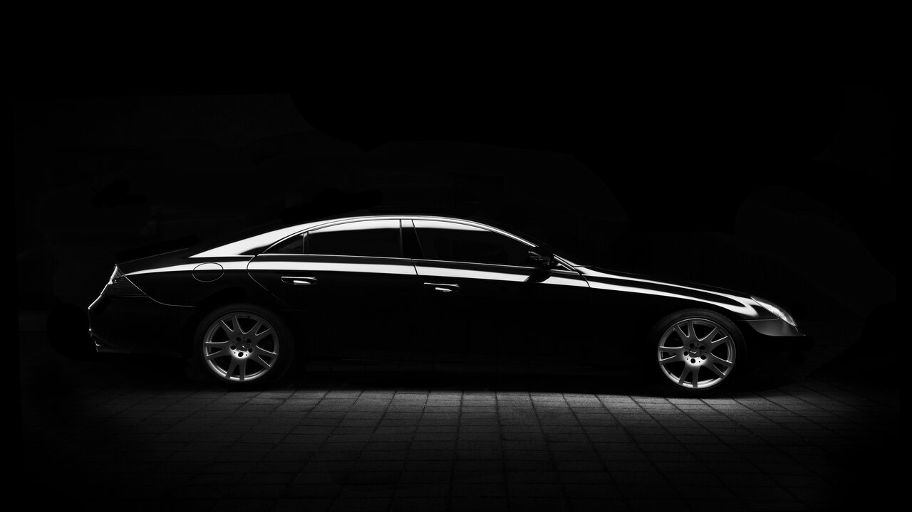
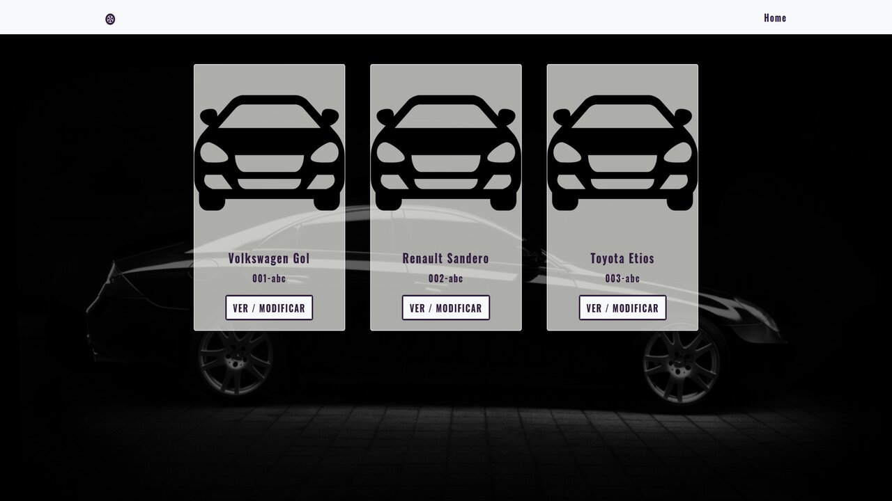
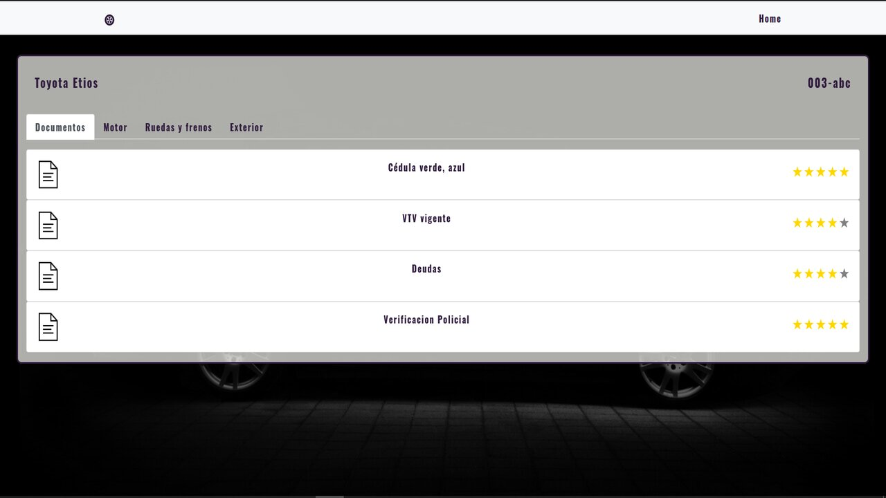
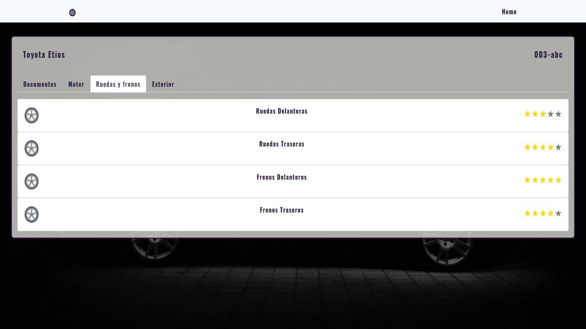

    

# Vehicle-App
- Aplicacion web que nos permite ver vehiclos y poder modificar el estado de sus partes, luces, motor, frenos, etc.
- Se creo tanto el back como el front. El diseño es Full Responsive.

## Tecnologías utilizadas :computer: 

* __Javascript__
* __React - Redux__
* __Bootstrap__
* __StyledComponent__
* __Node.Js__
* __Express__
* __PostgreSQL / Sequelize__
 

## Previews 🚗

    

    

    

